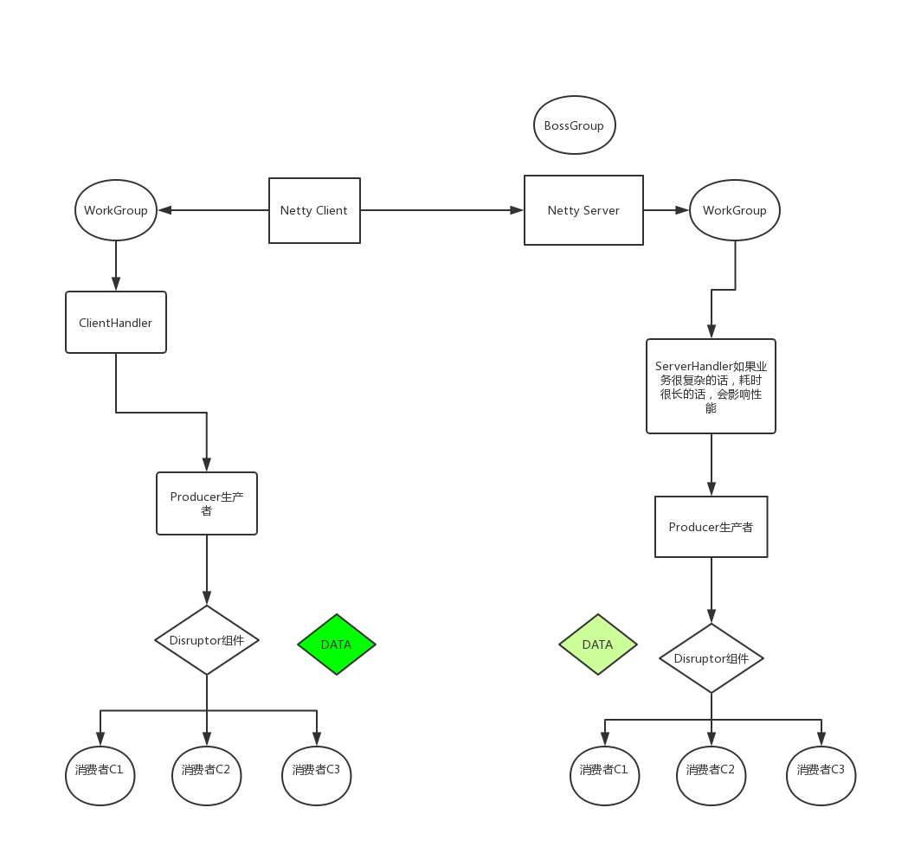
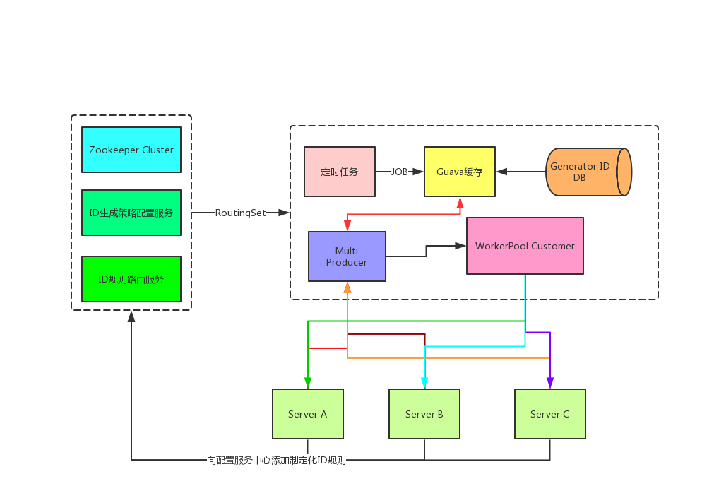

# Disruptor
## 第一章 Disruptor并发编程框架核心讲解
  ### Disruptor介绍
   * Martin Fowler在自己网站上写了一篇LMAX架构的文章[官网](https://lmax-exchange.github.io/disruptor/)
   * 在文章中他结束了LMAX是一种新型零售金融交易平台
   * 它能够以很低的延迟产生大量交易
   * 这个系统是建立在JVM平台上，其核心是一个业务逻辑处理器
   * 它能够在一个线程里每秒处理6百万订单
   * 业务逻辑处理器完全是运行在内存中，使用事件源驱动方式
   * 业务逻辑处理器的核心是Disruptor
   
  ### 快速实践
  * 建立一个工厂Event类，用于创建Event类实例对象
  * 需要有一个监听事件类，用于处理数据（Event类）
  * 实例化Disruptor实例，配置一系列参数， 编写Disruptor核心组件
  * 编写生产者组件，向Disruptor容器中去投递数据
  
  ### Disruptor 核心原理
  * 初看Disruptor，给人的印象就是RingBuffer是其核心，生产者向RingBuffer中写入数据，消费者从RingBuffer中消费数据
  * RingBuffer：它是一个环（首尾相接的环），它用作在不同上下文（线程）间传递数据的Buffer
  * RingBuffer拥有一个序号，这个序号指向数组中下一个可用元素
  * 随着你不停地填充这个buffer（可能也会有相应地读取），这个序号会一直增长，直到绕过这个环
  * 要找到数组中当前序号指向的元素，可以通过mod操作：sequence mod array length = array index （取模操作）以上面的 RingBuffer为例（Java的mod语法）：12 % 10 = 2
  * 事实上，上图中的RingBuffer只有10个槽完全是个意外。如果槽的个数是2的N次方更有利于基于二进制的计算机进行计算

  #### Disruptor核心 - RingBuffer
   * RingBuffer：基于数组的缓存实现，也是创建sequence与定义WaitStrategy的入口  
   * Disruptor：持有RingBuffer、消费者线程池Executor、消费者集合ConsumerRepository等引用
   
  ### Disruptor核心 - Sequence
   * 通过顺序递增的序号来编号，管理进行交换的数据（事件）
   * 对数据（事件）的处理过程总是沿着序号逐个递增处理
   * 一个Sequence用于跟踪标识某个特定的事件处理者（RingBuffer/Producer/Consumer）的处理进度
   * Sequence可以看成是一个AtomicLong用于标识进度
   * 还有另外一个目的就是防止不同Sequence之间[CPU缓存伪共享（False Sharing）](https://www.cnblogs.com/cyfonly/p/5800758.html)的问题
   
  ### Disruptor核心 - Sequencer
   * Sequencer是Disruptor的真正核心
   * 此接口有两个实现类
     * SingleProducerSequencer
     * MultiProducerSequencer
   * 主要实现生产者与消费者之间快速、正确地传递数据的并发算法
   
   ### Disruptor核心 - SequenceBarrier
   * 用于保持对RingBuffer的 Main Published Sequence（Producer）和 Consumer 之间的平衡关系；SequenceBarrier还定义类决定Consumer是否还有可处理的事件的逻辑。
   
   ### Disruptor核心 - WaitStrategy
   * 决定一个消费者将如何等待生产者将Event置入Disruptor
   * 主要策略有：
     * BlockingWaitStrategy（阻塞式）：它是最低效的策略，但其对CPU的消耗最小并且在各种不同部署环境中能够提供更加一致的性能表现
     * SleepingWaitStrategy（休眠式）：它的性能表现跟BlockingWaitStrategy差不多，对CPU消耗也类似，但其对生产者线程对影响最小，适合用于异步日志类似的场景
     * YieldingWaitStrategy（线程礼让式）：它的性能是最好的，适合用于低延迟的系统，在要求极高性能且事件处理线程数小于CPU逻辑核心数的场景中，推荐使用此策略；例如，CPU开启超线程的特性
     * ...
   
   ### Disruptor核心 - Event
   * Event：从生产者到消费者过程中所处理到数据单元
   * Disruptor中没有代码表示Event，因为它完全是由用户定义的
   
   ### Disruptor核心 - EventProcessor
   * EventProcessor：主要事件循环，处理Disruptor中的Event，拥有消费者的Sequence
   * 它有一个实现类是BatchEventProcessor，包含了event loop有效的实现，并且将回调到一个EventHandler接口到实现对象
   
   ### Disruptor核心 - EventHandler
   * EventHandler：由用户实现并且代表了Disruptor中到一个消费者的接口，也就是我们的消费者逻辑都需要写在这里
   
   ### Disruptor核心 - WorkProcessor
   * WorkProcessor：确保每个Sequence只被一个processor消费，在同一个WorkPool中处理多个WorkProcessor不会消费同样的sequence
   
 
 ## 第二章 Disruptor高级特性讲解
   ### Disruptor串、并行操作
   * ```EventHandlerGroup<T> handlerEventsWith(final EventHandler<? super T>... handlers)``` 
   * 串行操作：使用链式调用的方式
   * 并行操作：使用单独调用的方式
   
   ### Disruptor-多生产者模型讲解
   * 依赖Disruptor配置实现多生产者：
    ```RingBuffer.create(ProducerType producerType, EventFactory<E> factory, int bufferSize, WaitStrategy waitStrategy)```
   
   ### Disruptor-多消费者模型讲解
   * 依赖WorkerPool实现多消费者：
    ```workerPool(final RingBuffer<T> ringBuffer, SequenceBarrie sequenceBarrier, ExceptionHandler<? super T> exceptionHandler, WorkHandler<? super T>... workHandlers)```
    
  ## 第三章 Disruptor底层源码分析
   ### Disruptor底层性能为何如此高
   * 数据结构层面：使用环形结构、数组、内存预加载
   * 使用单线程写方式、内存屏障
   * 消除伪共享（填充缓存行）
   * 序号栅栏和序号配合使用来消除锁和CAS
   
   ### 高性能之道-数据结构-内存预加载机制
   * RingBuffer使用数组Object[] entries作为存储元素
   
   ### 高性能之道-内核-使用单线程写
   * Disruptor到RingBuffer，之所以可以做到可以无锁，也是因为"单线程写"，这是所有的"前提的前提"
   * 离了这个前提条件，没有任何技术可以做到完全无锁
   * Redis、Netty等高性能技术框架的设计都是这个核心思想
   
   ### 高性能之道-系统内存优化-内存屏障
   * 要正确的实现无锁，还需要另外一个关键技术：内存屏障
   * 对应到Java语言，就是volatile变量与happens before语义
   * 内存屏障 - Linux的smp_wmb()/smp_rmb()
   * 系统内核：用Linux的kfifo来举例：smp_wmb()，无论是底层的读写都是使用了Linux的smp_wmb
   * [Linux内核使用内存屏障源码实现](https://github.com/opennetworklinux/linux-3.8.13/blob/master/kernel/kfifo.c)
   
   ### 高性能之道-系统缓存优化-消除伪共享
   * 缓存系统中是以缓存行（cache line）为单位存储的
   * 缓存行是2的整数幂个连续字节，一般为32-256个字节
   * 最常见的缓存行大小是64个字节
   * 当多线程修改互相独立的变量时，如果这些变量共享同一个缓存行
   * 就会无意中影响彼此的性能，这就是伪共享
   
   ### 高性能之道-算法优化-序号栅栏机制
   * 我们在生产者进行投递Event的时候，总是会使用 ```long sequence = ringBuffer.next()```
   * Disruptor3.0中，序号栅栏SequenceBarrier和序号Sequence搭配使用协调和管理消费者与生产者的工作节奏，避免了锁和CAS的使用
   * Disruptor3.0中，各个消费者和生产者持有自己的序号，这些序号的变化必须满足如下基本条件：
        * 消费者序号数值必须小于生产者序号数值
        * 消费者序号数值必须小于其前置（依赖关系）消费者的序号数值
        * 生产者序号数值不能大于消费者最小的序号数值，以避免生产者速度过快，将还未来得及消费的消息覆盖
   
   ### WaitStrategy等待策略深度分析
   * Disruptor之所以是高性能，其实也有一部分原因取决于他等待策略的实现
   
  ## 第四章 Netty整合并发编程框架Disruptor
   ### 与Netty网络通信框架整合提升性能
   * 在使用Netty进行接收处理数据的时候，我们尽量都不要在工作线程上全编写自己的代码逻辑
   * 我们需要利用异步的机制，比如使用线程池异步处理，如果使用线程池就意味着使用阻塞队列，这里可以替换成Disruptor提高性能
   
   ### 构建Netty高性能的核心架构图
   
   
  ## 第五章 分布式统一ID生成服务架构设计
   ### 分布式统一ID生成策略抗压
   * 最简单就是用Java UUID工具类进行生成，生成的ID没有排序策略，如：雪花算法/数据库sequence序列、自增ID等
   * 顺序ID生成方式：通过KeyUtil生成的ID是有时间先后顺序的，可以用ID进行天然排序，避免浪费一个索引字段。从数据库角度来讲，一般能尽量减少索引，就减少索引。因为索引虽然可以提升查询性能，但也是需要占用空间的，并且一张表的索引不要超过3个，所以在做索引优化的时候，往往也是要根据业务来分析
   * 业务ID生成方式：使用带有业务含义的ID生成策略，这种方式也在传统应用系统、特定场景下非常好用。比如现在有一张商品货架表，这张表的数据维度是这样的，按照城市和区域来划分的。
   * 业界主流的分布式ID生成器的策略：
     * 实现一：提前加载，也就是预加载的机制，存放在内存中
        1. 提前加载，也就是预加载机制
        2. 并发的获取，采用Disruptor框架去提升性能
     * 实现二：单点生成方式
        1. 固定一个机器节点来生成一个唯一的ID，好处是能做到全局唯一
        2. 需要相应的业务规则拼接：机器码 + 时间戳 + 自增序列
        
   #### 为什么要进行拼接自增序列？ 
   * 在高并发的场景下，我们的生成ID请求量非常大，就会暴露出NTP的问题
   * NTP是网络时间协议（Network Time Protocol），它是用来同步网络中各个计算机时间的协议
   * 举个例子，如果单纯的采用：机器码+时间戳或者机器码+UUID这种组合，在高并发下可能会有订单重复的问题
   * 所以，我们要解决高并发下的NTP问题就要考虑周全：
     * 使用：机器码+时间戳+自增序列，即使是我们的时间戳被NTP服务校准产生回调，那么我们自增系列永远会在单点下保证自增，比如 AtomicLong就是很好的一种原子自增序列计数器
   
   #### 架构设计图
   